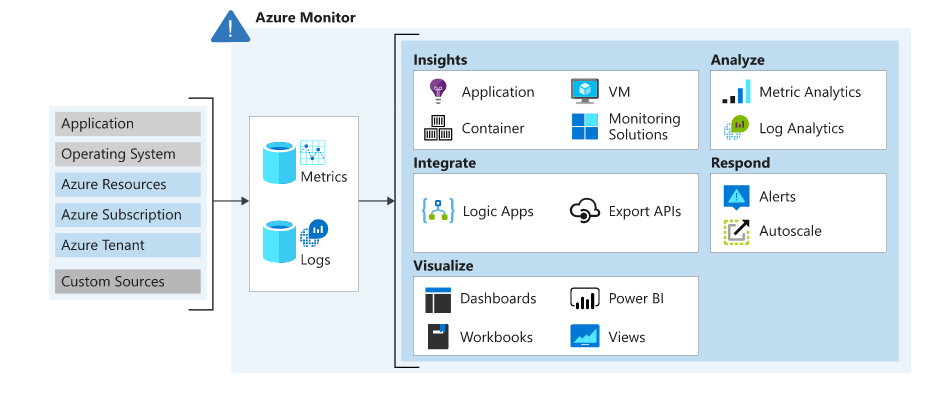

## Azure Monitor logs

Azure Monitor is a service for collecting and analyzing telemetry. 

### Data collection in Azure Monitor
Azure Monitor collects two fundamental types of data:
 - Metrics 
 - logs 

 